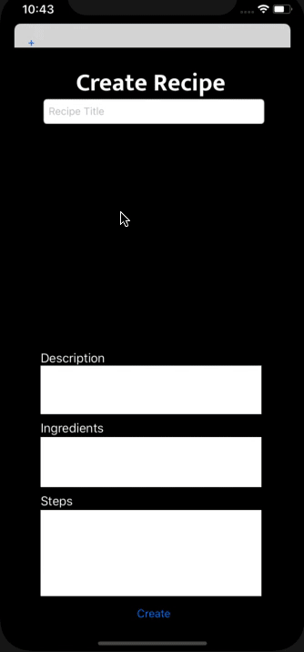

# InstaRecipe

## Table of Contents
1. [Overview](#Overview)
1. [Product Spec](#Product-Spec)
3. [Wireframes](#Wireframes)
4. [Schema](#Schema)

## Progress Demo

## Overview
### Description
InstaRecipe is a social media platform, but for recipes! You can share your own recipes, like and comment on other recipes, and even make changes to the recipes you like and re-share them!

### App Evaluation
- **Category:** Social Media / Cooking
- **Mobile:** Primarily for mobile users, but it could be expanded to have a web component as well
- **Story:** Users can scroll through their recipe feed, and interact with three different ways: like, comment, and fork
- **Market:** Anyone with an interest in cooking can try out this app
- **Habit:** The users can use the app based on how often they want to explore new recipes
- **Scope:** In the beginning we will let the users scroll through all the available recipes. Later on, we can add a 'friends' feature, so that users will only see their friends' recipes on their feed. We can also develop a recommendation engine for an 'explore' section, where users will be able to explore recipes based on their habit on the app.

## Product Spec

### 1. User Stories (Required and Optional)

<!-- **Required Must-have Stories**

- [X] Login
- [X] Register
- [ ] User can create a class (they are the instructor).
- [ ] User can create posts (ask questions)
- [ ] User can answer to posts (with distinguishment between instructor and student answer) -->

**Required Must-have Stories**

- [X] Login
- [X] Register
- [x] User can create a recipe 
- [ ] User can update a recipe
- [x] User can scroll through existing recipes
- [ ] User can like and fork recipes
- [ ] Users can view their profiles (will include list of recipes forked)

<!-- **Optional Nice-to-have Stories**
* User can create a group (of students).
* Users can upvote posts
* Users can view their profiles (Will include classes enrolled, graduation date)
* Users can type in markdown
* If instructors upvote a student's answer, it highlights it (endorses it) -->
**Optional Nice-to-have Stories**
- [x] Users can comment on recipes
- [ ] Users can send and receive follow requests
- [ ] Users will be recommended recipes via a recommendation engine: an explore section
- [ ] Users can chat with the people they are following
- [x] User stays logged in across restarts

### 2. Screen Archetypes

* Login Screen
   * User can login
* Registration Screen
   * User can create a new account
* Create Recipe Screen
   * User can create a recipe
* View Recipes Screen
   * Users can explore existing recipes
* Profile Screen
    * Users can view their profile    
 

### 3. Navigation

<!-- **Tab Navigation** (Tab to Screen)

* Home Feed (View Recipes)
* Create Recipe (Add Button)
* Profile

Optional:
* Settings -> Dark Mode
* Stories -->

**Flow Navigation** (Screen to Screen)
* Forced Log-in -> Account creation if no log in is available
* Create Recipe -> Add Recipe Modal -> Back to Feed with new recipe added
* Profile Bubble on top right -> Profile screen
* Add Recipe on top left -> Add Recipe Modal -> Back to My Posts

## Wireframes
[See Wireframes](https://www.figma.com/file/sPEv2V5j5IoboVXFe3lhNC/Curios-IOS?node-id=0%3A1)

### [BONUS] Digital Wireframes & Mockups

### [BONUS] Interactive Prototype

## Schema 
[This section will be completed in Unit 9]
### Models

#### User
| Property | Type | Description |
| -------- | ---- | ----------- |
| userId   | String | unique    |
| name     | String | name of user |
| username | String | username of user |
| email | String | email of user |
| password | String | password of user |

#### Recipe

   | Property      | Type     | Description |
   | ------------- | -------- | ------------|
   | objectId      | String   | unique id for recipe (default field) |
   | author        | Pointer to User| image author |
   | image         | File     | image that user posts |
   | caption       | String   | image caption by author |
   | comments      | Array of Pointer to Comment | all comments belonging to recipe |
   | commentsCount | Number   | number of comments that has been posted to an image |
   | likesCount    | Number   | number of likes for the recipe |
   | forksCount    | Number   | number of forks for the recipe |
   | createdAt     | DateTime | date when recipe is created (default field) |
   | updatedAt     | DateTime | date when recipe is last updated (default field) |
   | isForked | Boolean | true if forked, false otherwise

#### Comment
   | Property      | Type     | Description |
   | ------------- | -------- | ------------|
   | objectId      | String   | unique id for comment (default field) |
   | author        | Pointer to User| comment author |
   | recipe        | Pointer to Recipe | recipe of comment |
   | text | String | comment text |
   | likesCount | Number | number of likes for the comment |
   | createdAt     | DateTime | date when recipe is created (default field) |
   | updatedAt     | DateTime | date when recipe is last updated (default field) |
   

### Networking
- [Add list of network requests by screen ]
- Login Screen
    - (Create/POST) Authenticate User
- Register Screen
    - (Create/POST) Create new user
- Home Feed Screen
    - (Read/GET) Query all recipes
    - (Create/POST) Create a new like on recipe post
    - (DELETE) Remove an existing like
    - (Create/POST) Create a new comment on a receipe post.
    - (DELETE) Delete an existing comment
- Profile Screen
    - (Read/GET) Query all recipes belonging to current user
    - (Create/POST) Create a new comment on a recipe
    - (DELETE) Delete an existing comment (both own + other people's comments)
    - (Create/POST) Create a new like on a recipe
    - (DELETE) Remove an existing like
    - (DELETE) Delete an existing recipe

- Create Receipe Screen
    - (Create/POST) Create a new recipe post object
